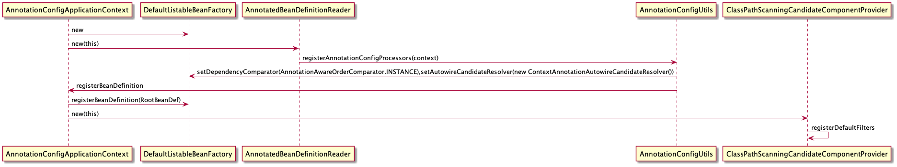
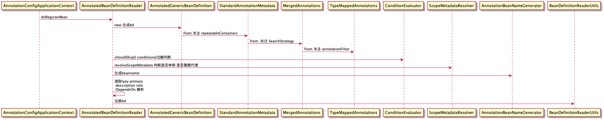

# Spring 源码分享      
## AnnotationConfigApplicationContext 启动流程
* 第一部忽略注入依赖
* ignoredDependencyInterfaces
  * BeanNameAware 
  * BeanFactoryAware
  * BeanClassLoaderAware
* 第五步会往BeanFactory 内部注册5个BeanDefinition 
  * ConfigurationClassPostProcessor:
  * AutowiredAnnotationBeanPostProcessor:
  * CommonAnnotationBeanPostProcessor:
  * PersistenceAnnotationBeanPostProcessor(如果有对应包):
  * EventListenerMethodProcessor:
  * DefaultEventListenerFactory:
* 第八步会注册过滤器
  * Component
  * ManagedBean
  * Named 

### 注册beandefinition 流程
.png)
### applicationContext.register 流程

### applicationContext.refresh 流程

@startmindmap
* refresh
** prepareRefresh
*** initPropertySource
*** getEnvironment().validateRequiredProperties()
** obtainFreshBeanFactory
*** refreshBeanFactory
** postProcessBeanFactory
** invokeBeanFactoryPostProcessors
** registerBeanProstProcessors
** initMessageSource
** initApplicationEventMulticaster
** onRefresh
** registerListeners
** finishBeanFactoryInitialization
** finishRefresh
*** clearResourceCaches
*** initLifecycleProcessor
*** getLifecycleProcessor().onRefresh
*** publishEvent(new ContextRefreshedEvent(this))
@endmindmap
